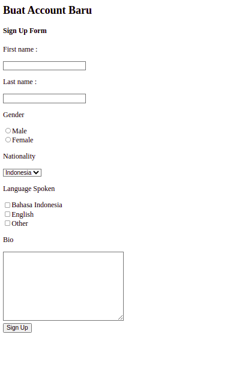
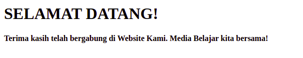
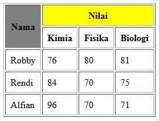
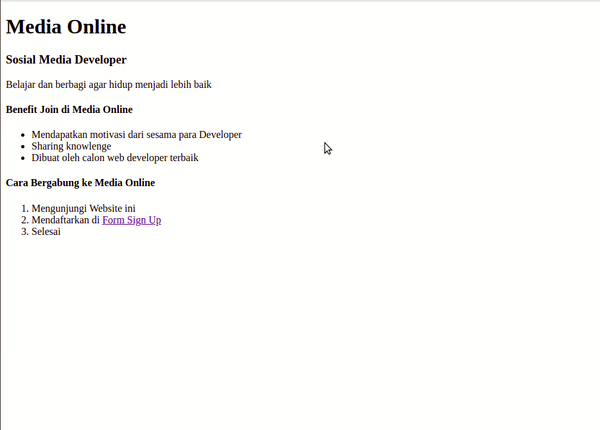

# Berlatih HTML

## Target‌

* Menguasai dasar-dasar HTML
* Menguasai tag-tag pada HTML

Petunjuk Pengerjaan

1. Buat File HTML index
   Buatlah sebuah file **index.html** yang akan menampilkan halaman seperti berikut:\
   

2. Buat halaman form
   Buatlah file baru bernama **form.html** yang berisi form seperti berikut :\
   *nb: Gunakan Element Form untuk Menuju ke welcome.html*
   

3. Buat halaman selamat datang
   Setelah user berhasil mendaftar, berikan halaman **welcome.html** yang memberikan ucapan selamat datang seperti berikut:\
   *nb: tambahkan Element anchor / link untuk Menuju ke data.html dan index.html*
   

4. Buat halaman list data siswa
   Setelah user berhasil mendaftar, berikan halaman **data.html** yang memberikan ucapan selamat datang seperti berikut:\
   *nb: tambahkan Element anchor / link untuk ke index.html dan form.html*
   

### Hasil Akhir

Setelah semua file html yang kita perlukan siap, maka website kita sudah berjalan jika kita mulai dari index.html

