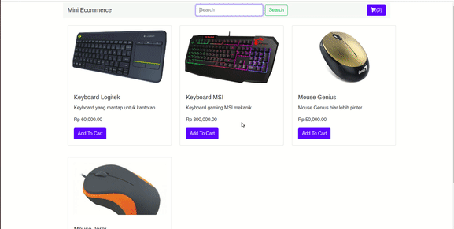

Hari 5 – Berlatih DOM Javascript
 
Target Pembelajaran
Mengerti tentang Selektor pada DOM
Mengerti dan mengaplikasikan event pada DOM
 
Petunjuk Pengerjaan
Terdapat sebuah template html bernama index.html. Halaman ini adalah sebuah mini-ecommerce sederhana. Pada halaman tersebut sudah tersedia beberapa element awal yaitu navbar dan bagian content utama. Tugas kamu adalah melengkapi halaman tersebut agar menjadi lebih interaktif menggunakan DOM Javascript.

```html
<!DOCTYPE html>
<html lang="en">
<head>
    <meta charset="UTF-8">
    <meta name="viewport" content="width=device-width, initial-scale=1.0">
    <meta http-equiv="X-UA-Compatible" content="ie=edge">
    <title>Latihan DOM</title>
    <link rel="stylesheet" href="https://stackpath.bootstrapcdn.com/bootstrap/4.3.1/css/bootstrap.min.css" 
    integrity="sha384-ggOyR0iXCbMQv3Xipma34MD+dH/1fQ784/j6cY/iJTQUOhcWr7x9JvoRxT2MZw1T" crossorigin="anonymous">
    <script defer src="https://use.fontawesome.com/releases/v5.8.1/js/all.js" 
    integrity="sha384-g5uSoOSBd7KkhAMlnQILrecXvzst9TdC09/VM+pjDTCM+1il8RHz5fKANTFFb+gQ" crossorigin="anonymous"></script>
</head>
<body>
    <div class="container">
        <nav class="navbar navbar-light bg-light">
            <a class="navbar-brand">Mini Ecommerce</a>
            <form class="form-inline" id="formItem">
                <input class="form-control mr-sm-2" type="search" placeholder="Search"  id="keyword" aria-label="Search">
                <button class="btn btn-outline-success my-2 my-sm-0" type="submit" id="searchItem">Search</button>
            </form>
            <button class="btn btn-primary" id="cart"><i class="fas fa-shopping-cart"></i>(0)</button>
        </nav>
        <div class="row">
            <div class="row col-md-12 mt-2"  id="listBarang" >
                
            </div>
        </div>
    </div>
    <script src="https://stackpath.bootstrapcdn.com/bootstrap/4.3.1/js/bootstrap.min.js" 
    integrity="sha384-JjSmVgyd0p3pXB1rRibZUAYoIIy6OrQ6VrjIEaFf/nJGzIxFDsf4x0xIM+B07jRM" crossorigin="anonymous"></script>
</body>
</html>
```

 
Release 0
Halaman index html ketika pertama diload akan menampilkan seluruh barang yang tersedia di mini-ecommerce. Misalkan terdapat data yang kita peroleh dari Database seperti berikut:

```js
var items = [
    ['001', 'Keyboard Logitek', 60000, 'Keyboard yang mantap untuk kantoran', 'logitek.jpg'], 
    ['002', 'Keyboard MSI', 300000, 'Keyboard gaming MSI mekanik', 'msi.jpg'],
    ['003', 'Mouse Genius', 50000, 'Mouse Genius biar lebih pinter', 'genius.jpeg'],
    ['004', 'Mouse Jerry', 30000, 'Mouse yang disukai kucing', 'jerry.jpg']
]
```

Tampilkanlah setiap barang tersebut dengan menggunakan Card yang sudah ditentukan seperti berikut:

```html
<!-- Component Card dari Bootstrap --> 
<div class ="col-4 mt-2"> 
<div class="card" style="width: 18rem;">
    
    <div class="card-body">
        <h5 class="card-title" id="itemName">Nama</h5>
        <p class="card-text" id="itemDesc">Deskripsi barang</p>
        <p class="card-text">Rp Harga</p>
        <a href="#" class="btn btn-primary" id="addCart">Tambahkan ke keranjang</a>
    </div>
</div>
</div>
```


Petunjuk : Lakukan looping/perulangan terhadap items yang menghasilkan element Card. Setiap Card berisi data sesuai dengan data di variable items.

File gambar-gambar item bisa kamu download dari sini :

[asset image]('https://drive.google.com/drive/folders/1lD0sYljThT5UrUKOnq1R21tI_2ByKu-J')

Release 1
Ketika semua item berhasil tampil selanjutnya kamu diminta agar User dapat melakukan pencarian item melalui form search pada Navbar. Misalkan ketika User mengetik “Mouse” maka akan ditampilkan item Mouse saja. Jika mengetik “Keyboard” maka akan ditampilkan item Keyboard saja. Selain itu tidak akan menampilkan apapun.

Petunjuk : Tangkaplah event ```submit``` pada form id=”formItem”. Di dalam event tersebut dapatkan value dari input search. Setelah itu lakukan filter pada items yang nama itemnya sesuai dengan kata kunci pencarian.

Release 2
Pada Card Item terdapat button “Tambahkan ke Keranjang”, buatlah event ketika diklik button tersebut maka pada button Icon keranjang di navbar (```id = "cart"```) akan bertambah +1.

Simulasi Hasil Release 0 dan Release 1
Berikut contoh hasil untuk release 0 dan release 1:


Release 0 dan Release 1 : Menampilkan barang dengan DOM dan memfilternya melalui form search
 

Simulasi Hasil Release 2
Berikut contoh hasil untuk release 2

![release-2](img/release-2-dom-challenge.gif

Release 2: menambahkan barang ke keranjang